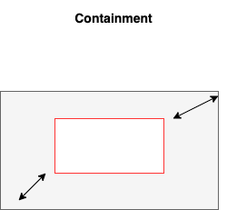
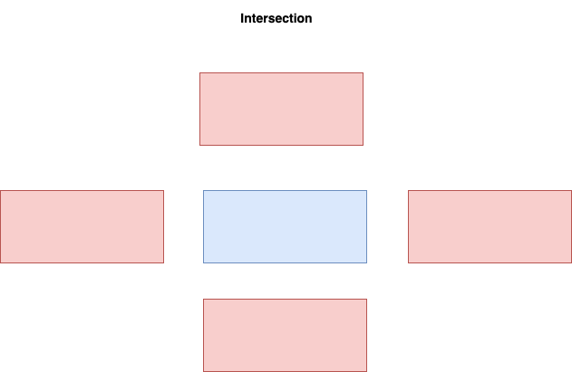

# Rectangles
Checks if two rectangles have intersection, are contained in each other or are adjacent.

* **Console Application**

The exercise was solved using a .Net Console Application

## IDE
* This Console Application was developed using Visual Studio Code.

## Packages and Libraries
* [Net 6.0](https://learn.microsoft.com/en-us/dotnet/core/whats-new/dotnet-6)
* [Xunit](https://learn.microsoft.com/en-us/dotnet/core/testing/unit-testing-with-dotnet-test)

## Run Locally
* Clone the repository.
* You can use Visual Studio or VSCODE.
* Execute `dotnet run` or clic on the `Play Button`.

## Solution
* In order to validate if one rectangle is wholly conatined within another we need to check if the bottom left corner X and Y axis are greater than
the bigger rectangle, and the top right corner X and Y axis are less than the bigger rectangle.

* In order to validate if the rectangles have intersections we need to ensure that one rectangle is not above or under or next to the other one.

